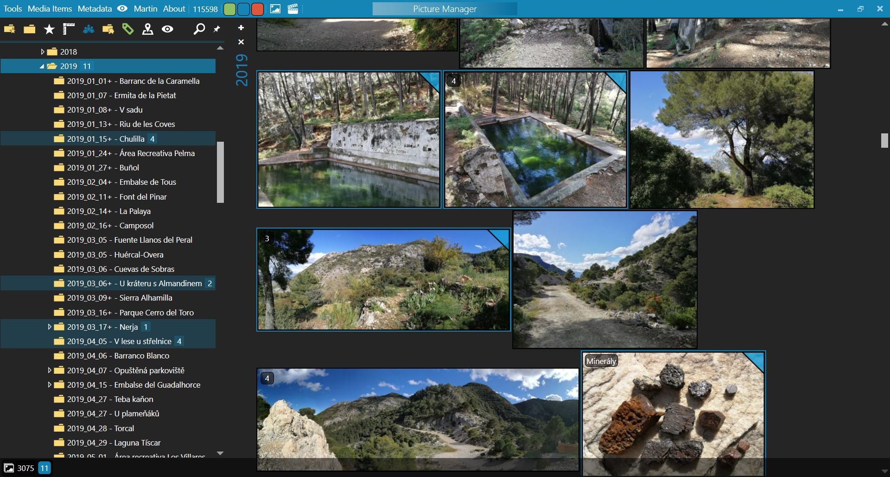

# Picture Manager

## Info in this file is outdated! I don't have any motivation to keep it up to date. 🙃

### What is new?
- People view with people grouped by category and keywords.
- A person can have keywords.
- Segments of images (something like face tagging).
- Database backup.
- Loading thumbnails is 10x faster.
- Thumbnail tabs have options to group by folder/date and sort.
- And more ...

_Usable but not tested by others yet!_

Picture Manager is a simple image and video viewer with the ability of creating clips from video, tagging faces and editing keywords like rating, people, hierarchical keywords, comments and geo names.

## Browser

### 1. Side bar
On top of the side bar there are shortcuts to scroll to each category in the tree and button to search across all categories in the tree.

- ### Favorite Folders
  Favorite Folders are shortcuts to Folders. They can be added by `right-click` on the Folder choosing **Add to Favorites** or removed by `right-click` on the favorite folder choosing **Remove from Favorites**. Folder tree is expanded to the chosen Favorite Folder by `left-click` on the favorite folder.
- ### Folders
  Folders are main entry points for browsing media items. Media items are imported and thumbnails are created after `left-click` on a folder. Media items import and thumbnail creation is done only once. Each next load is much faster. Media items can be also loaded from subdirectories by `Shift + left-click` on the folder.
  A folder can be moved by `drag-and-drop` or copied with `Ctrl + drag-and-drop`. Folders can also be renamed or deleted from `right-click` menu on the folder.
- ### Ratings
- ### Sizes
  Sizes show a range of MegaPixels of the loaded media items. It can be used to filter the loaded media items by adjusting this range.
- ### People
  This category can contain a group of people or only a person.
  A group can be created by choosing **New Group** from the `right-click` menu on the category. It can also be renamed or deleted from `right-click` menu on the group. When a group is deleted, all people in the group are moved to the root of this category.
  A person can be created by choosing **New** from the `right-click` menu on the category or the group. It can be renamed or deleted from the `right-click` menu on the person. When a person is deleted, it is just deleted from the internal database and not from the actual media items!
  People can be moved between the groups by `drag-and-drop`.
- ### Folder Keywords
  _Folder Keywords_ are something like _Folders_ but one _Folder Keyword_ can be linked to multiple folders. The contents of the folders will be merged under one _Folder Keyword_.
  For example: When two folders (`D:\Pictures\subfolder\subfolder\` and `P:\subfolder\`) are set as _Folder Keywords_ from the `right-click` menu on the folder, the contents of these folders will be merged under the _Folder Keywords_ category.
- ### Keywords
  This category can contain a group of keywords or only a keyword.
  A group can be created by choosing **New Group** from the `right-click` menu on the category. It can also be renamed or deleted from the `right-click` menu on the group. When a group is deleted, all keywords in the group are moved to the root of this category.
  A keyword can be created by choosing **New** from the `right-click` menu on the category, a group or another keyword and renamed or deleted from the `right-click` menu on the keyword. When a keyword is deleted, it is just deleted from the internal database and not from the actual media items!
  Keywords can be moved between groups by `drag-and-drop`. Sort order of the keywords can be changed by `drag-and-drop`.
- ### GeoNames
  _GeoNames_ are added from http://geonames.org by selecting the media items with GPS coordinates and `left-click` on **Tools/GeoNames** or by `right-click` on _GeoNames_ category and entering GPS coordinates in this format **N36.75847,W3.84609**.
- ### Viewers
  A viewer is something like a workspace with included and excluded folders. The folders can be added from the `right-click` menu on a viewer or removed from the `right-click` menu on a folder.
  When no viewer is present, the application works with all available folders.

### 2. Thumbnails

The size of thumbnails can be set in **Tools/Settings**. Thumbnails can be created again when the size is changed through **Media Items/Rebuild Thumbnails**. Thumbnails can be zoomed in or out with `Ctrl + mouse scroll` without changing the size in the settings.
The selection can be made by `left-click` or with the combination `Shift or Ctrl + left-click` or selecting all with `Ctrl + A`.

### 3. Keywords

Keywords are additional data for media items. Media items can be filtered or loaded by keywords only if they have been imported through `left-click` on the Folder.

Media items can be loaded by `left-click` on the _Ratings_, _People_, _Folder Keywords_, _Keywords_ and _GeoNames_. Loading can also be applied to subdirectories with the `Shift + left-click`.

The filter is applied to the previously loaded media items and can by edited from `right-click` menu on _Ratings_, _People_, _Keywords_ and _GeoNames_:

- _Filter And_: for having all selected keywords on loaded media items
- _Filter Or_: for one or more selected keywords on loaded media items
- _Filter Not_: for excluding media items with selected keywords

The Keywords on media items can be edited by entering the edit mode with `Ctrl + E`. In this mode the Keywords will be added or removed from selected media items by `left-click` on _Rating_, _Person_, _Keyword_ or _GeoName_. The edit can be saved with `Ctrl + S` or canceled with `Ctrl + Q`.

The Comments on media items can be edited with `Ctrl + K` without the need of entering the edit mode.

## Viewer

Viewer can be opened from the browser by `double-click` on the thumbnail and closed by `double-click` or `Esc`. The navigation between media items is done by `left and right arrow key` or with `mouse-scroll`. An image can be zoomed to 100% by holding `left-mouse-button` or changed to any zoom with `Ctrl + mouse-scroll`. An image can also be moved around if it is bigger than the screen by holding `left-mouse-button`.
The presentation can be turned on/off with `Ctrl + P`.
### 1. Video Player
  Video player plays a video in the infinite loop. Speed, volume and timeline is located on the top. Each video can contain clips (sections of video defined by time stamps). Clips can be added, renamed, deleted, moved to groups and reordered in the slide panel on the right side of the screen.
  
  Defining clips can be done either with buttons `A` and `B` or with `Alt + S` shortcut. Each clip gets its own volume and speed set durning setting the time stamps with `A` or `B` button.
  
  Play type defines what should be played. If clips or groups are selected, clips are looped for at least the time set on "repeat for" slider before the next clip is played.
   - Video: plays video file in infinite loop
   - Clip: plays selected clip in infinite loop
   - Clips: plays all clips regardless of location (in groups or not)
   - Groups: plays clips in a group

## Segments
A segment is a square selection from an image that can be connected to a person and can have multiple keywords. Segment is used as a tool tip on the person in the tree and as a profile photo in the People view for each person. Segment used for this can be changed by dragging one of the person's segments to the top segments in the person's detail (select People category in the tree and click on `i` button on person).

Segments can be created, edited or deleted in the viewer by clicking on the toggle button from the top toolbar. To create new segments use `Ctrl + left-mouse-button` or just `right-mouse-button`.

You can set a person to a selected segment from the tree one by one or select multiple images in the browser (if nothing is selected => all images are taken) and select `Media Items => Segments Matching` from the top menu.

### Segments Matching
This is just experimental! I tried an automatic face detection and face recognition, but the detection is not 100% and I want a nice looking face selection so I ended up with removing the detection (so just a manual selection is available) and keeping recognition for now even if it has also very poor results (I tried serval methods).

Selected segments can be set as the same person with the `=` button on the selected segments. These segments get a new temporary person with a negative ID and this person can be later changed to a named person by selecting any segment and selecting the person from the tree.

All segments linked to one named person can be viewed by clicking on `i` button on the segment.

All source images with segments linked to the same person as is the person on the segment can be viewed by `double-click` on the segment.
